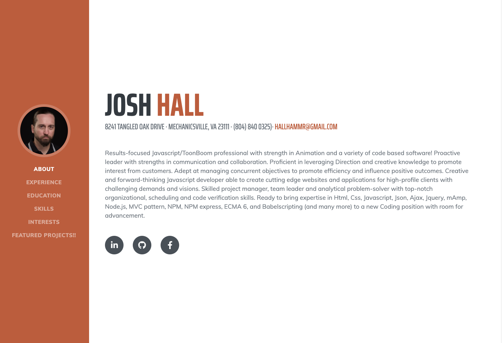

# Updated-portfolio

https://joshhallrva.github.io/Updated-portfolio/. 

Updated portfolio
MY updated site has the following content:

- My name 

- Links to my GitHub profile & LinkedIn page as well as my email address and phone number 

- A link to a PDF of your resume 

- A list of projects. For each project, make sure you have the following: 

  - Project title 

  - Link to the deployed version 

  - Link to the GitHub repository 

* Profile picture 

* Bio 

* Location 

* Email 

* Link to your portfolio 

